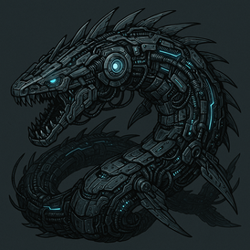

  

# Leviath
Bot Discord utilisé dans un serveur Multigaming.

Le but principal sera d'automatiser certaines tâches de recherches d'infos et la centralisation de celles-ci. 
Ensuite les features seront dev selon l'intérêt.

---

__Fonctions présentes:__
| Commandes Slash   | Descriptif                                              |
|:-----------------:|:--------------------------------------------------------|
| `/addRSS`         | Ajoute le suivi d'actualités de l'URL spécifié          |

| Commandes Texte | Descriptif                                                    |
|:---------------:|:--------------------------------------------------------------|
| `rules`         | Affiche le règlement du serveur                               |

| Événements               | Descriptif                                                          |
|:------------------------:|:--------------------------------------------------------------------|
|`DynamicVoiceChannel`     | Crée un nouveau salon vocal portant le nom de l'utilisateur         |

## Ressources

#### 📂 __[Structure du projet](./ProjectStructure.md)__

#### 🔧 __[Fonctionnalités en réflexion](./Features.md)__

#### 🔐 __[Permissions](./BotConfig.md)__

## Invitation Discord
#### 🤖 __[Leviath](https://discord.com/oauth2/authorize?client_id=1356445603583758357&permissions=582047826996343&integration_type=0&scope=bot)__
#### 🤖 __[Leviath[Dev]](https://discord.com/oauth2/authorize?client_id=1356448589248856085&permissions=582047826996343&integration_type=0&scope=bot)__

## Roadmap
🛠️ En développement 
⚠️ Correctif nécessaire 
📠Planifié 
✅ Terminé 
🔄 Reporté 
⏸️ Arrêté 
⌠Annulé 

---

### Release v1.10.0:
| Version  | Objectif                                                      | État |
|:--------:|:--------------------------------------------------------------|:----:|
| v1.0.0   | Initial Commit                                                | ✅ |
| v1.1.0   | Affectation auto du rôle "Membre"                             | ✅ |
| v1.2.0   | Commande de suppression de messages                           | 🛠️ |
| v1.3.0   | Commande d'ajout de flux RSS                                  | 🛠️ |
| v1.4.0   | Système de logs des membres: arrivée, listing selon rôles,..  | 📝 |
| v1.5.0   | Intégrer l'API d'un LLM de MistralAI                          | _ |

## License
Le projet Leviath est sous licence MIT.